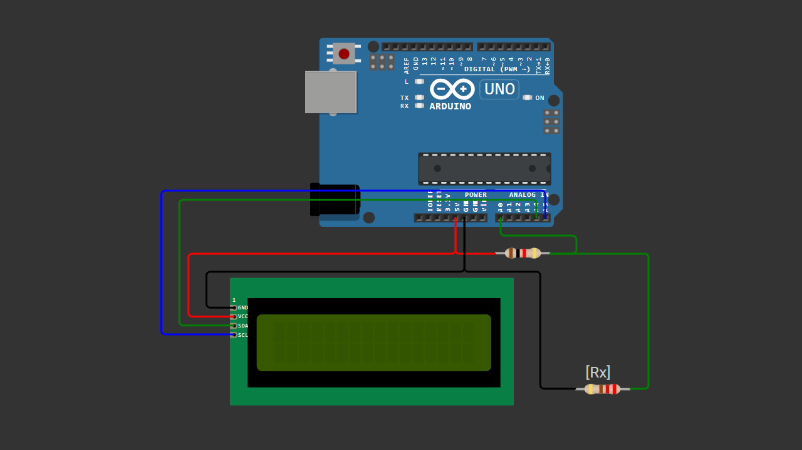

# Simple Arduino Ohm Meter with 16x2 I2C LCD

A beginner-friendly Arduino project that measures resistor values using a voltage divider circuit and displays the result on a 16x2 I2C LCD.

This project is designed for learning basic electronics concepts such as analog reading, voltage dividers, and resistance measurement.

---

## 📌 Project Overview

This Arduino Ohm Meter uses a 1K reference resistor and the Arduino ADC (Analog-to-Digital Converter) to estimate unknown resistor values.

The measured resistance is displayed in real time on a 16x2 I2C LCD.

This project works best for measuring resistors between:

```text
100Ω to 1KΩ
```

It is intended as a beginner learning project rather than a precision replacement for a digital multimeter.

---

## 🧰 Components Required

- Arduino Uno / Nano  
- 16x2 I2C LCD  
- 1K Ohm resistor (reference resistor)  
- Breadboard  
- Jumper wires  
- Resistor to measure  

---

## 🔌 Wiring Connections

### LCD I2C → Arduino

| LCD I2C | Arduino |
|----------|----------|
| VCC      | 5V       |
| GND      | GND      |
| SDA      | A4       |
| SCL      | A5       |

---

### Ohm Meter Circuit

```text
5V ----[1K REF]----+----[Rx]---- GND
                   |
                  A0
```

| Component | Connection |
|------------|------------|
| 1K Reference Resistor | Between 5V and A0 |
| Unknown Resistor (Rx) | Between A0 and GND |

---

## 📷 Wiring Diagram



> Make sure your wiring matches the diagram above before uploading the code.

---

## 💻 Arduino Code

You can download the Arduino sketch here:

[Download Arduino Code](Arduino_Ohm_Meter_with_16x2_I2C_LCD.ino)

Or open the `.ino` file directly inside this repository.

---

## 🚀 Getting Started

1. Connect all components according to the wiring diagram.
2. Install the `LiquidCrystal_I2C` library.
3. Upload the Arduino sketch.
4. Connect a resistor to the measurement terminals.
5. Read the resistance value on the LCD display.

---

## 🧠 Learning Concepts

This project helps beginners understand:

- Voltage divider circuits  
- Analog input reading  
- Resistance measurement basics  
- ADC (Analog-to-Digital Conversion)  
- I2C LCD communication  

---

## ⚠️ Measurement Limitation

This simple Ohm Meter is optimized for:

```text
100Ω to 1KΩ
```

Higher resistance values can still be measured, but accuracy may decrease because the project uses a fixed 1K reference resistor.

---

## 🎥 Video Tutorial

Watch the full step-by-step tutorial on YouTube:

[](https://youtu.be/bziSjg59-HI)

In this video, you will see:
- Complete wiring tutorial  
- Arduino code explanation  
- Real resistor testing  
- LCD resistance display demonstration  
- Voltage divider learning explanation  

If this project helps you, consider subscribing for more beginner-friendly Arduino tutorials 🚀

---

## 📄 License

This project is open-source and free to use for educational purposes.

---

Happy Coding 🚀
